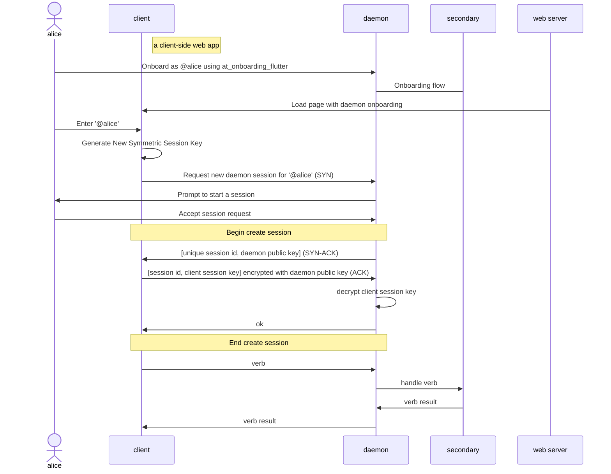

# at_daemon

## What is at_daemon?

at_daemon is designed to be a local proxy that serves the at_client over
websockets which can be accessed by client-side rendered (CSR) web applications.

## Components

### at_daemon_cli

A cli server for at_daemon.

### at_daemon_desktop

A desktop version of the at_daemon server, designed for consumer use.

### at_daemon_core

The core functionality of the at_daemon server.

### at_daemon_client

A client that allows web applications to interact with the local
at_daemon server.

## Sequence Diagram

